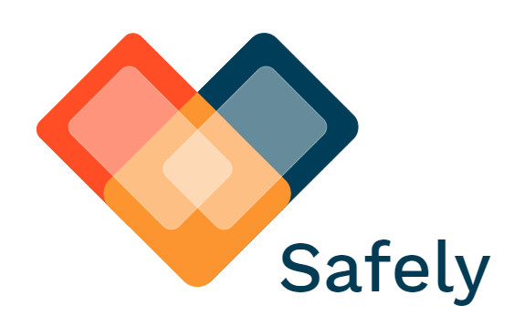

#### _Safely_ is a social-based pandemic monitoring application which tracks the spreading of deceases on a neighborhood scale.

# Features
Stuff stuff stuff stuff stuff stuff stuff stuff stuff stuff stuff stuff stuff stuff stuff stuff stuff stuff stuff stuff stuff stuff stuff stuff stuff stuff stuff stuff stuff stuff stuff stuff stuff stuff stuff stuff stuff stuff stuff stuff stuff stuff stuff stuff stuff stuff stuff stuff stuff stuff stuff stuff stuff stuff stuff stuff stuff stuff stuff stuff stuff stuff stuff stuff stuff stuff stuff stuff stuff stuff stuff stuff

# Usage
Stuff stuff stuff stuff stuff stuff stuff stuff stuff stuff stuff stuff stuff stuff stuff stuff stuff stuff stuff stuff stuff stuff stuff stuff stuff stuff stuff stuff stuff stuff stuff stuff stuff stuff stuff stuff stuff stuff stuff stuff stuff stuff stuff stuff stuff stuff stuff stuff stuff stuff stuff stuff stuff stuff stuff stuff stuff stuff stuff stuff stuff stuff stuff stuff stuff stuff stuff stuff stuff stuff stuff stuff

# Installation
Stuff stuff stuff stuff stuff stuff stuff stuff stuff stuff stuff stuff stuff stuff stuff stuff stuff stuff stuff stuff stuff stuff stuff stuff stuff stuff stuff stuff stuff stuff stuff stuff stuff stuff stuff stuff stuff stuff stuff stuff stuff stuff stuff stuff stuff stuff stuff stuff stuff stuff stuff stuff stuff stuff stuff stuff stuff stuff stuff stuff stuff stuff stuff stuff stuff stuff stuff stuff stuff stuff stuff stuff

# Team
| Y. Demers | W. Laplante | F. Schmitt  | L. Weishaupt  |
| :---:     | :-:         | :-:         | :-:           |
| I'll put sum cute pics   | I'll put sum cute pics   | I'll put sum cute pics   | I'll put sum cute pics   |
| https://github.com/yaeldemers | https://github.com/williamlaplante | https://github.com/FynnSu | https://github.com/luca-weishaupt |

## Disclaimer
(i) _Safely_ hasn't been released publically yet. It is still in alpha stage and needs improvements on many fronts before it is commercially available. Any distribution of _Safely_ - done without the development team's approval - might lead to legal actions.

(ii) The development team of _Safely_ and each of its individuals will not, under any circomstances, use the data provided by the user for any reason but the operation of said-application.

(iii) By utilising _Safely_ you give us permission to use your geo-location data aswell as your health status for the monitoring of the decease (in this case COVID19). By utilising _Safely_ you also accept to not press charge against our development team and each of its individuals regarding the usage of your data, unless it is used for any reasons other than the operation of said-application.
